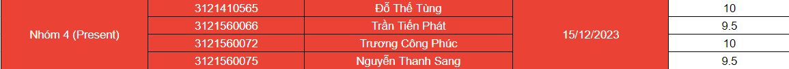

# Website_posting_about_study_abroad_countries

## 1. Các thành viên tạo nên
- ### Trang web được viết vào năm 3 đại học (2023-2024) cùng với các thành viên : Fat , Sang_Ngai , TungBE và PhucApu
- ### Học thầy Từ Lãng Phiêu được điểm số :

- ### Các công việc của các thành viên :
  - ### SangNgai : Responsive trang web trên các thiết bị máy tính bảng và điện thoại, hỗ viết HMLT + CSS và JavaScript, viết ppt và báo cáo word.
  - ### Fat : Responsive trang web trên các thiết bị máy tính bảng và điện thoại, hỗ viết HMLT + CSS và JavaScript, Tester trang web và sửa lỗi.
  - ### PhucApu : Viết JavaCript, hỗ trợ viết HTML + CSS và thiết kế dữ liệu trên LocalStorage.
  - ### TungBE : Viết cải tiến bằng ngôn ngữ PHP + mySQL các chức năng đăng nhập, quản lý người dùng và quản lý liên hệ trong Admin, hỗ trợ viết HTML + CSS.

## 2. Mô tả sơ lược và chức năng có trong đồ án web:
1. ### Mô tả sơ lược
   #### Đồ án _"Website chứa thông tin du học"_ là trang web chứa các bài đăng mô tả thông tin về du học ở các quốc gia, điều kiện du học, thông tin học bổng,... và là nơi kết nối những người có ước mơ và định hướng ở chân trời mới.
2. ### Các chức năng chính có trong đồ án
   - #### Chức năng đăng nhập, đăng ký.
   - #### Chức năng bình luận, bày tỏ cảm xúc dưới mỗi bài đăng ( chỉ khi bạn đăng nhập ).
   - #### Chức năng xem bài đăng.
   - #### Chức năng đăng bài (Chức năng của Admin )
     Mô tả: Bạn phải đưa bài cần đăng cùng với các hình ảnh liên quan đến bài đăng cho Admin, Admin sẽ định dạng bài đăng đó lại và để nó vào thư mục **storega** dưới tên **" post_{thứ tự bài đăng} "** để khi chạy trang web, hệ thống bên dưới có thể tìm và load các bài đăng đó lên.
   - #### Chức năng quản lý bình luận (Chức năng của Admin)
     Mô tả: Admin có thể xem các bình luận liên quan đến bài đăng tương ứng. Có thể xem người nào bình luận, có thể ẩn và hiện các bình luận đó đi.
   - #### Chức năng quản lý người dùng (Chức năng của Admin)
     Mô tả: Admin có thể xem thông tin của các tài khoản người dùng trên hệ thống, có thể xóa vĩnh viễn hoặc cấm tài khoản đó đi.
   - #### Chức năng quản lý liên hệ ( Chức năng cải tiến bằng PHP của Admin)
     Mô tả: Admin có thể xem nội dung mà người dùng phản ánh trong trang liên hệ, từ đó có thể phản hồi lại bằng cách gửi mail cho người dùng đó.
   - #### Một số chức năng phụ khác: chức năng load dữ liệu bài đăng tự động khi refesh lại trang, chức năng cuộn tự động lên đầu trang bằng nút bấm, chức năng xem nhanh bài đăng trong cửa sổ pop-up, chức năng xem thêm lịch hội thảo du học,...

## 3. Hướng dẫn sử dụng
- ### Đối với đồ án chạy 100% bằng ___livesever và dữ liệu được lưu trên LocalStogare___ :
  - Tìm thư mục có tên "HomeForGuest" và chạy file "index.html".
  - Lướt xuống dưới cùng file "index.html", mở các link js khởi tạo dữ liệu trên LocalStorage.
  - Sau khi khởi tạo dữ liệu xong, đóng các link js đó lại.
  - Tài khoản Admin để test : 
    - Tên đăng nhập : Admin000
    - Mật khẩu : 123123
  - Tài khoản người dùng để test:
    - Tên đăng nhập : User123
    - Mật khẩu : 123123
- ### Đối với đồ án cải tiến, chạy bằng XAMPP : ( liên hệ bạn TungBE )

## 4. Thông tin liên hệ
- ### PhucApu: [Facebook](https://www.facebook.com/profile.php?id=100015316112957)

